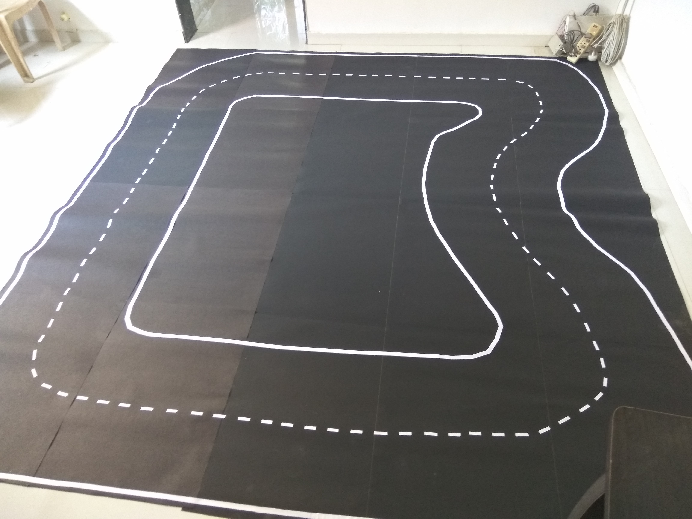
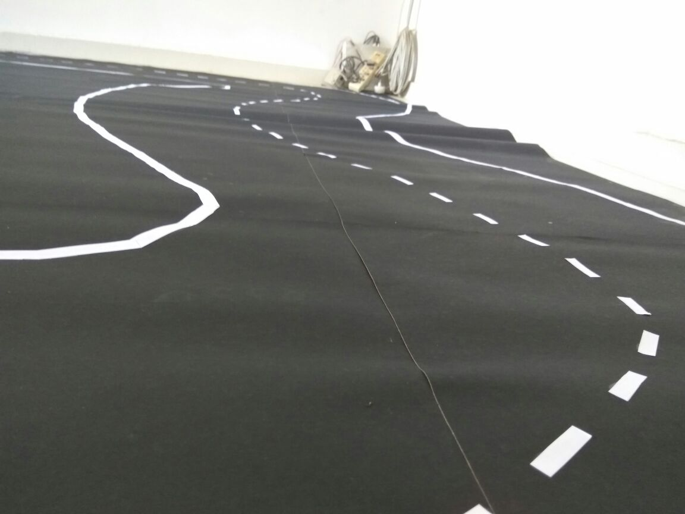

# Autonomous Car
Collaborator: [Aman Agarwal](https://amanbasu.github.io), [Aditya Mishra](https://aditya985.github.io)

This project uses various Deep Learning model architectures to classify the self-generated road data for building an autonomous car.

[Link](amanagarwal.io/files/autoCar.pdf) to the paper.
```
@article{AmanAutoCar,
  title={Behavioral Cloning in Autonomous Vehicle UsingDeep Learning},
  author={Aman Agarwal and Aditya Mishra and Priyanka Sharma}
}
```


### How to run

1. Download the **Autonomous-Arena** data from [kaggle](https://www.kaggle.com/firstofhisname/indoor-car-track).

2. Train the model by running this command:

   ```bash
   python tf_model_cnn.py
   ```

3. Check this [notebook](review.ipynb) for more details.

4. Use [this](https://www.kaggle.com/firstofhisname/autonomous-arena-guide) notebook to explore the dataset.

### Car Prototype


### Images

The bluetooth-controlled car was driven on an indoor track and the training data was generated by taking images from a camera mounted on the car. The images were labelled manually into 4 categories:
1. Front (F)
2. Left  (L)
3. Right (R)
4. Stop  (S)

 

### Image Processing
In order to reduce the computation, images were resized from 480x640 to 24x32 pixels.
Then the images were cropped to keep only the track area. Final image size was 14x32 pixels.
The images were normalized before giving them to the input layer.

### Model Architectures
#### 1. CNN
The first model of cnn was of two convolutional layer followed by 2 fully connected and then the output layer.
The model accuracy was around 91%.
Since, the images were manually labelled, there was a huge human error. 91% accuracy of model is hence justified.
[Go to file](tf_model_cnn.py)

#### 2. RNN
The RNN model was trained with two LSTM layers. Accuracy was 93%.
[Go to file](tf_model_rnn.py)

#### 3. CNN + RNN

The final model was cnn followed by rnn. This model performed very badly on the training data with the accuracy of 70% since, after the convolutional layer, there was huge loss in the temporal features of the data.
[Go to file](tf_model_cnn_rnn.py)

Find more details about the project [here](review.ipynb).
